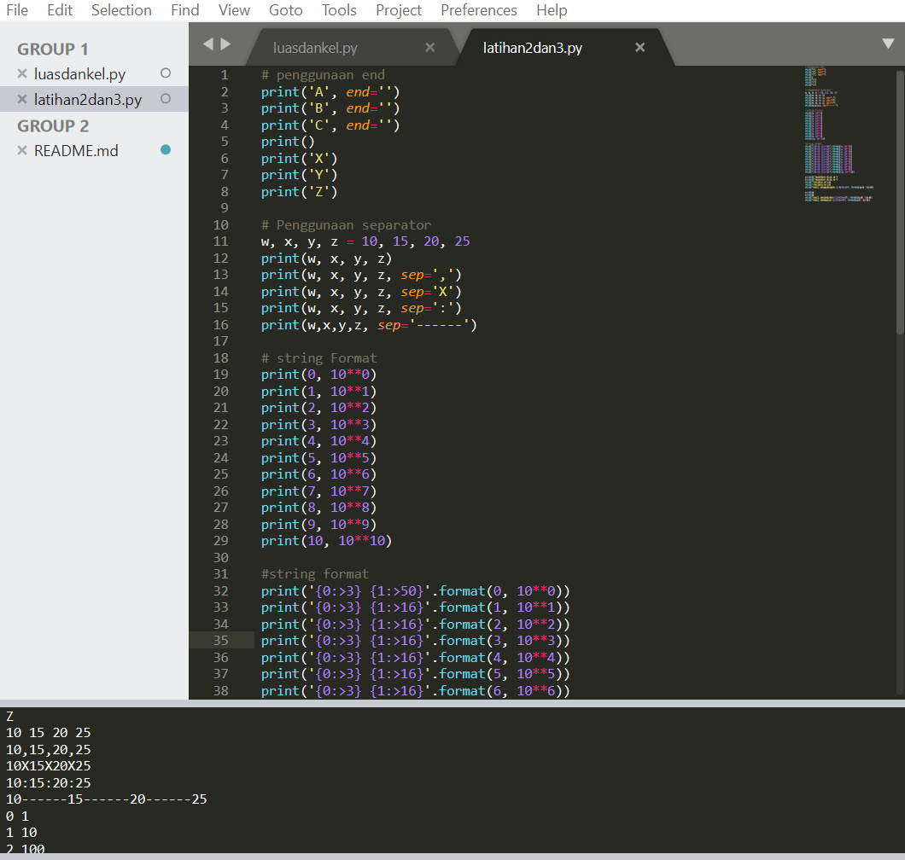
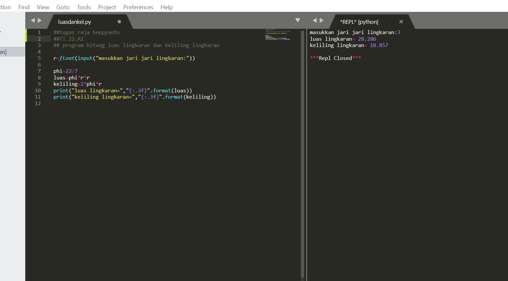
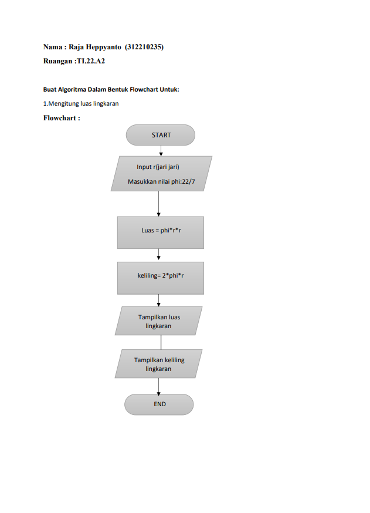

## **PERTEMUAN 6 TIPE DATA VARIABEL DAN OPERATOR**

### **ADA BEBERAPA TIPE OPERATOR YAITU**
#### arithmetic operator,comparison,assigment,logical,bitwise,membership,danidentity
#### sebagai contoh alan saya lampirkan foto dibawah ini

### **menghitung luas lingkaran**
#### variabel pi = 3.14
#### variabel r = jari-jari lingkaran
#### variabel l = luas lingkaran
#### variabel k = keliling
### **Pembahasan**
#### Deklarasikan variabel pi = 3.14, secara otomatis menggunakan tipe data float karena bernilai desimal.
#### masukan nilai Jari-jari (r), inputan dibungkus float agar perhitungan dapat mengoprasikan nilai desimal.
#### Mengimplementasikan Rumus Luas dan Keliling.
#### Cetak memakai "{:.3f}".format(luas) kenapa? karena "{:.3f}".format(), membatasi 3 karakter dibelakang koma.
### **SEBAGAI CONTOH AKAN SAYA LAMPIRKAN SS SINTAKSNYA, ANDA JUGA DAPAT MELIHAT DI FILE YANG SAYA UPLUAD DI ATAS**

### **DALAM BENTUK FLOWCART HITUNG LUAS DAN KELILING LINGKARAN**

### sekian pemaparan saya jika ada tutur kata yang salah mohon di maafkan
### Terima kasih